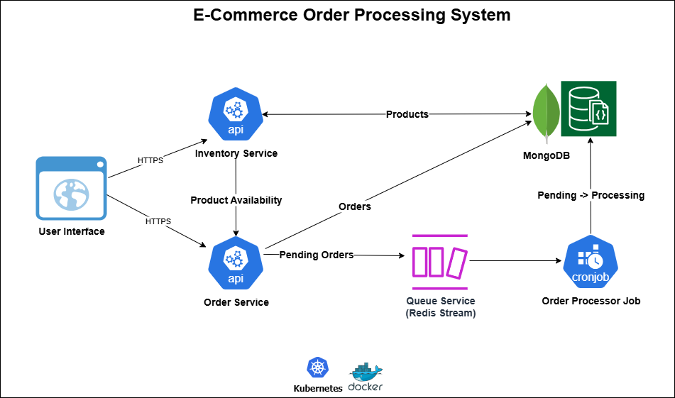

## Ecommerce Order Processing System

This backend system handles order processing for an e-commerce platform, leveraging microservices and asynchronous queues for scalability and reliability.
Frontend/UI development, Payment gateway integrations, Authentication/authorization mechanisms, Reporting dashboards or analytics are out of scope for now.

### Microservices

---

##### Inventory Service

Manages product catalog, stock, price information.

#### Order Service

Handles order creation, retrieval, cancellation, and product availability against inventory.
Rest API Endpoints:
- `POST /order`: Create a new order with multiple product items
- `GET /order?id=`: Retrieve order details by ID
- `GET /orders`: Retrieve all orders
- `GET /order?status=`: Retrieve orders by status (PENDING, PROCESSING etc.)
- `DELETE /order?id=`: Cancels an order by ID but only if it is in PENDING state.

#### Queue Service

A Redis Stream service that maintains order streams persistently in k8s PVC for asynchronous processing. Orders are pushed to Redis streams when created, allowing for decoupled processing and handling large volume of orders in peak times.

#### Order Processor (Job)

Consumes orders from Redis streams and processes them in the background. It updates the PENDING order status to PROCESSING state every 5 minutes.

#### MongoDB Instance

Stores product catalog (inventory), orders and metadata persistently.

### How It Works

---

#### Event-Driven Architecture (System Design):


User places an order via the Order Service.

Order Service validates product availability (stock) through the Inventory Service.

Order is placed/stored in MongoDB for analytics and retrieval purposes, with an initial order status of PENDING.

Simultaneously, The Order ID is also pushed to a Redis stream (queue) for asynchronous processing like (payments handling, notification etc.).

Order Processor (Background Job) consumes messages from Redis stream every 5 minutes, executes business logic, and updates order status from PENDING to PROCESSING in MongoDB.

Scalability: Each microservice can be independently scaled and deployed using Kubernetes, while MongoDB supports sharding and indexing to handle large volumes of orders efficiently.

### Folder Structure

---
The project is organized as a monorepo containing multiple microservices and shared packages. Used cert based authentication (password less) for MongoDB client to ensure security.
Authentication certificates are stored in k8s secrets securely. Each service is self-contained with its own Dockerfile, Kubernetes manifests, and internal packages. The shared code (like MongoDB and Redis Stream clients) is placed in a common `pkg` directory for reuse across services.
The structure is as follows:
```
├── README.md
├── go.mod                     # Go module file for dependency management
├── go.sum                  
├── inventory-service          # Inventory service microservice
├── k8s                        # Kubernetes manifests for all services (ingress, namespace, secrets)
├── order-processor            # Background job processor for order processing
├── order-service              # Order service microservice
├── pkg                        # Shared packages (mongoDB, Redis Stream) across all services
├── queue-service              # Redis Stream service for order processing
└── tests                      # Unit tests for order-service
```

### Local Development Setup

---

**Prerequisites:** Linux System (WSL if on Windows), Docker Compose, Minikube (Single node k8s cluster), MongoDB Atlas, kubectl client

**Install Dependencies:**

Install Go from [here](https://go.dev/doc/install)

Get mongoDB sandbox (free-tier) credentials from [MongoDB Atlas](https://www.mongodb.com/atlas/database) and create a cluster.

Install minikube from [here](https://minikube.sigs.k8s.io/docs/start/?arch=%2Fwindows%2Fx86-64%2Fstable%2F.exe+download)

Install Docker from [here](https://docs.docker.com/desktop/setup/install/windows-install/)

Clone this repository.

**Build Docker images for all services**

```
eval $(minikube docker-env)  # Point local docker to minikube
cd /ecommerce-order-processing # Navigate to the project root directory

docker build -t inventory-service:latest -f ./inventory-service/Dockerfile .
docker build -t order-service:latest -f ./order-service/Dockerfile .
docker build -t queue-service:latest -f ./queue-service/Dockerfile .
docker build -t order-processor:latest -f ./order-processor/Dockerfile .
```

**Load docker images to minikube**

```
minikube image load inventory-service:latest
minikube image load order-service:latest
minikube image load queue-service:latest
minikube image load order-processor:latest
```

**Apply Kubernetes manifests to launch the microservices**

Update the deployment files in the `k8s` directory with your MongoDB connection string and Redis Stream configuration if needed.
```
kubectl apply -f ./k8s/inventory-service/
kubectl apply -f ./k8s/order-service/
kubectl apply -f ./k8s/queue-service/
kubectl apply -f ./k8s/order-processor/
```

**Verify pods and services**
```
kubectl get pods
kubectl get svc
kubectl logs <pod-name> --follow  # Check real-time logs for any service
```
All microservices follow the same pattern: Dockerfile, Kubernetes manifests, and environment configuration.

### To Do

---
- [ ] Implement API security layer (JWT, OAuth2, etc.)
- [ ] Add API documentation (Swagger/OpenAPI) for all services
- [ ] Add monitoring and logging for better observability
- [ ] Implement CI/CD pipeline for automated builds and deployments
